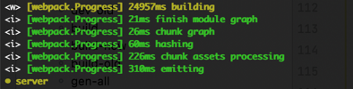
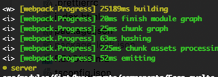
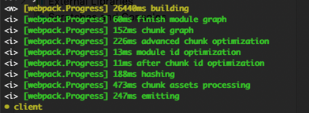
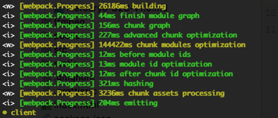

# 


# Profiling

| | concatenateModules: False | concatenateModules: Ture |
| --- | --- | --- |
|Server| |  |
|Client| |  |


# 1. webpack.config.client.js

```typescript
  optimization: {
    concatenateModules: true,
  },
```

# 2. package.json 

dev 命令添加output 参数，目的是减少两次构建

原因： sapper 构建的文件生成到src/node_modules/@sapper 下，导致src目录文件变化出发重新构建

```json
  "dev": "cross-env NODE_ENV=development sapper dev --no-hot --routes routes -p 4000 --output dist/@sapper"
```
